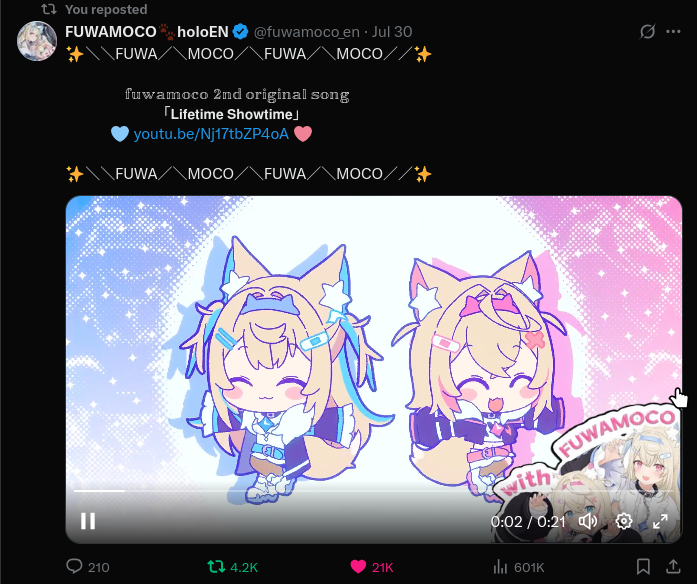

# Supported Modes and Settings

Below are the supported sites/modes you can enable, and what settings are available for each of them!

# TOC

- Supported Modes and Settings
  - [Global FWMC (bottom right)](#global-fwmc-bottom-right)
  - [YouTube Thumbnails](#youtube-thumbnails)
  - [Twitter/X Media](#twitterx-media)
  - [HTML Elements](#html-elements)
- [Suggestions?](#suggestions)

## Global FWMC (bottom right)

  

| Setting | Description | Default |
| --- | --- | --- |
| Enabled | Whether to enable this mode. | `true` |
| Image Width | The width of the image. Must be a [valid CSS max-width](https://developer.mozilla.org/en-US/docs/Web/CSS/max-width). | `10vw` |
| Image Height | The height of the image. Must be a [valid CSS max-height](https://developer.mozilla.org/en-US/docs/Web/CSS/max-height). | `auto`
| Image Opacity (0.0 - 1.0) | The opacity of the image. 0.0 being 0%, 0.5 being 50%, and 1.0 being 100%. | `1.0` |

## YouTube Thumbnails

> [Thanks to arashari for the inspiration!](https://github.com/arashari/chrome-ext-with-fwmc)

YouTube Video | YouTube Shorts | YouTube Notification
:-:|:-:|:-:
 |  | 

| Setting | Description | Default |
| --- | --- | --- |
| Enabled | Whether to enable this mode. | `true`
| Image Width | The width of the image. Must be a [valid CSS max-width](https://developer.mozilla.org/en-US/docs/Web/CSS/max-width). | `55%` |
| Image Height | The height of the image. Must be a [valid CSS max-height](https://developer.mozilla.org/en-US/docs/Web/CSS/max-height). | `41%`

## Twitter/X Media

Video | Image
:-:|:-:
 | 

| Setting | Description | Default |
| --- | --- | --- |
| Enabled | Whether to enable this mode. | `false`
| Image Width | The width of the image. Must be a [valid CSS max-width](https://developer.mozilla.org/en-US/docs/Web/CSS/max-width). | `55%` |
| Image Height | The height of the image. Must be a [valid CSS max-height](https://developer.mozilla.org/en-US/docs/Web/CSS/max-height). | `41%`

## HTML Elements

> **EXTREME BAU BAU MODE!** Adds FUWAMOCO to every image and video! *BAU at your own risk!*

> Work-in-progress; expect buggy behavior! Also may cause a lot of lag.

  

| Setting | Description | Default |
| --- | --- | --- |
| Enabled | Whether to enable this mode. | `false`
| Image Width | The width of the image. Must be a [valid CSS max-width](https://developer.mozilla.org/en-US/docs/Web/CSS/max-width). | `55%` |
| Image Height | The height of the image. Must be a [valid CSS max-height](https://developer.mozilla.org/en-US/docs/Web/CSS/max-height). | `41%`

# Suggestions?

Got a new mode you want to suggest? Feel free to [make an issue with your suggestion](https://github.com/snowydqys/With-FUWAMOCO/issues/new?template=feature_request.md)! I'm always looking for new ways to BAU BAU!
